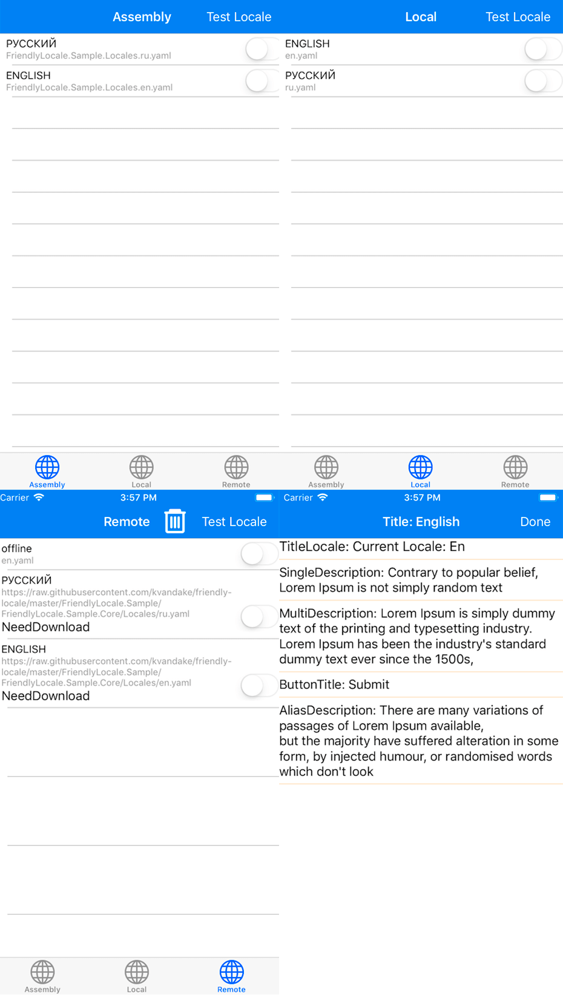

# Friendly Locale(Beta) 
[website](https://kvandake.github.io/friendly-locale/)

Simple and cross platform internationalization for Xamarin and .NET. The localization is similar to [Ruby On Rails](http://guides.rubyonrails.org/i18n.html).

[](https://travis-ci.org/kvandake/friendly-locale)

Features:
- Cross platform;
- No dependencies;
- [Yaml](http://www.yaml.org/) instead of [Resx](https://msdn.microsoft.com/en-us/LIBRARY/ekyft91f(v=vs.85).aspx);
- Support **Remote Resources**;
- Support **Assets Resources**;
- Support **Embedded Resources**.

## Sample
[Sample project](FriendlyLocale.Sample)


## Yaml as the foundation
[Yaml website](http://www.yaml.org/)

The library use YAML because it is easier for humans to read and write than other common data formats like XML or JSON.
### The differences between yaml and resx
Unfriendly format on resx
```xml
<data name="FirstViewModel.Title" xml:space="preserve">
    <value>FirstViewModel Title</value>
</data>
<data name="FirstViewModel.Description" xml:space="preserve">
    <value>FirstViewModel Description</value>
</data>
<data name="FirstViewModel.SubmitTitle" xml:space="preserve">
    <value>SubmitTitle</value>
</data>
<data name="FirstViewModel.EmptyData.Title" xml:space="preserve">
    <value>FirstViewModel EmptyData Title</value>
</data>
<data name="FirstViewModel.EmptyData.Description" xml:space="preserve">
    <value>FirstViewModel EmptyData Description</value>
</data>
<data name="SecondViewModel.Title" xml:space="preserve">
    <value>SecondViewModel Title</value>
</data>
<data name="SecondViewModel.SubmitTitle" xml:space="preserve">
    <value>SubmitTitle</value>
</data>
```
This is easily written on the Yaml markup:
```yaml

buttons: &BUTTONS
  SubmitTitle: "SubmitTitle"

FirstViewModel:
  Title: "FirstViewModel Title"
  Description: "FirstViewModel Description"
  <<: *BUTTONS
  EmptyData:
    Title: "FirstViewModel EmptyData Title"
    Description: "FirstViewModel EmptyData Description"
    
SecondViewModel:
  Title: "SecondViewModel Title"
  <<: *BUTTONS
```

## Install
https://www.nuget.org/packages/FriendlyLocale
```
PM> Install-Package FriendlyLocale
```

To use, simply reference the nuget package in each of your platform projects.
* **You can not add to each platform if you use embedded resources from the assembly.**

## Setup

### Embedded resources from Assembly
[AssemblyContentConfig.cs](FriendlyLocale/Configs/AssemblyContentConfig.cs)
```cs
var assembly = this.GetType().GetTypeInfo().Assembly;
var assemblyConfig = new AssemblyContentConfig(assembly)
{
    ResourceFolder = "Locales"
};

FriendlyLocale.I18N.Initialize(assemblyConfig);
```

### Assets resources

[AssetsContentConfig.cs](FriendlyLocale/Configs/AssetsContentConfig.cs)

```cs
var assetsConfig = new AssetsContentConfig
{
    ResourceFolder = "Locales"
};

FriendlyLocale.I18N.Initialize(assetsConfig);
```

### Remote resources

[RemoteContentConfig.cs](FriendlyLocale/Configs/RemoteContentConfig.cs)

#### Offline mode is supported

[OfflineContentConfig.cs](FriendlyLocale/Configs/OfflineContentConfig.cs)

- ##### Assets file
```cs
var offlineConfig = OfflineContentConfig.FromAssets("en.yaml", "Locales");
```
- ##### Embedded resource
```cs
var assembly = this.GetType().GetTypeInfo().Assembly;
var offlineConfig = OfflineContentConfig.FromAssembly(assembly, "ru.yaml", "Locales");
```
And the final step of initialization
```cs
var remoteConfig = new RemoteContentConfig
{
    Locales =
    {
        {"ru", "https://any.com/ru.yaml"},
        {"en", "https://any.com/en.yaml"}
    }
};
// offlineConfig - optional
FriendlyLocale.I18N.Initialize(remoteConfig, offlineConfig);
```

### Additional settings
All config files includes this properties:
* **ThrowWhenKeyNotFound** - Optional: Throw an exception when keys are not found (recommended only for debugging);
* **Logger** - Action to output traces.

## Using
Change Locale
```cs
// basic
await FriendlyLocale.I18N.ChangeLocale("en");

// offline mode for remote
await FriendlyLocale.I18N.ChangeLocale("offline");
```
Change Locale with download progress
```cs
var progress = new Progress<float>();
progress.ProgressChanged += (s, e) =>
{
    Console.WriteLine($"Download progress: {e}");
};
await this.I18N.ChangeLocale("en", progress);
```
Translate
```cs
var value = FriendlyLocale.I18N.Instance.Translate("key");

// en.yaml:
//   key:
//     innerkey: "InnerValue"
//     more:
//       morekey: "MoreValue"
var innerValue = FriendlyLocale.I18N.Instance.Translate("key.innerkey"); // InnerValue
var moreValue = FriendlyLocale.I18N.Instance.Translate("key.more.morekey"); // MoreValue
```

## Localization file syntax
More inforamtion on http://www.yaml.org/spec/1.2/spec.html.
### Simple using
```yaml
FirstViewModel:
  Title: "Title"
  Empty:
    Title: "Not found"
    TitleButton: "Refresh data"
```
Get the value:
```cs
var title = I18N.Instance.Translate("FirstViewModel.Title");
var emptyTitle = I18N.Instance.Translate("FirstViewModel.Empty.Title");
var emptyTitleButton = I18N.Instance.Translate("FirstViewModel.Empty.TitleButton");
```

### Using Multiline
```yaml
FirstViewModel:
  MultiDescription1: |
    MultiDescription: Lorem Ipsum is simply dummy text of the printing and typesetting industry. 
    Lorem Ipsum has been the industry's standard dummy text ever since the 1500s, 
  MultiDescription2: >
    Lorem Ipsum is simply dummy text of the printing and typesetting industry. 
    Lorem Ipsum has been the industry's standard dummy text ever since the 1500s, 
```
`>` - [Folded style](http://www.yaml.org/spec/1.2/spec.html#id2796251) removes single newlines within the string (but adds one at the end, and converts double newlines to singles).

`|` - [Literal style](http://www.yaml.org/spec/1.2/spec.html#id2795688) turns every newline within the string into a literal newline, and adds one at the end.

Get the value:
```cs
var multiDescription1 = I18N.Instance.Translate("FirstViewModel.MultiDescription1");
var multiDescription2 = I18N.Instance.Translate("FirstViewModel.MultiDescription2");
```

### Using Anchor - Alias
More inforamtion on https://learnxinyminutes.com/docs/yaml/.
```yaml
alias: &ALIAS
  AliasDescription: "AliasDescription"
  
FirstViewModel:
  <<: *ALIAS
```
Get the value:
```cs
var aliasDescription = I18N.Instance.Translate("FirstViewModel.AliasDescription");
```

## Support Enum types, Naming formats

### Support for enum types
```yaml
# Animal Enum
Animal:
  Dog: Dog Value
  Cat: Cat Value
  Monkey: Monkey Value
  
FirstViewModel:
  Title: First Title
```
Get the value:
```cs
public enum Animal
{
    Dog,
    Cat,
    Monkey
}

var valueCat = I18N.Instance.TranslateEnum(Animal.Cat); // Cat Value
```

### Support naming formats
```yaml
ViewModel:
  Title: Title {foo}, {bar}
```
Get the value:
```cs
var nf = new {foo = "Foo Value", bar = "Bar Value"};
// value = Title Foo Value, Bar Value
var value = I18N.Instance.TranslateNamingFormat("ViewModel.Title", nf);
```

## Roadmap
- Add more tests;
- Automatic change of values when changing localization;
- Detailed code documentation.
